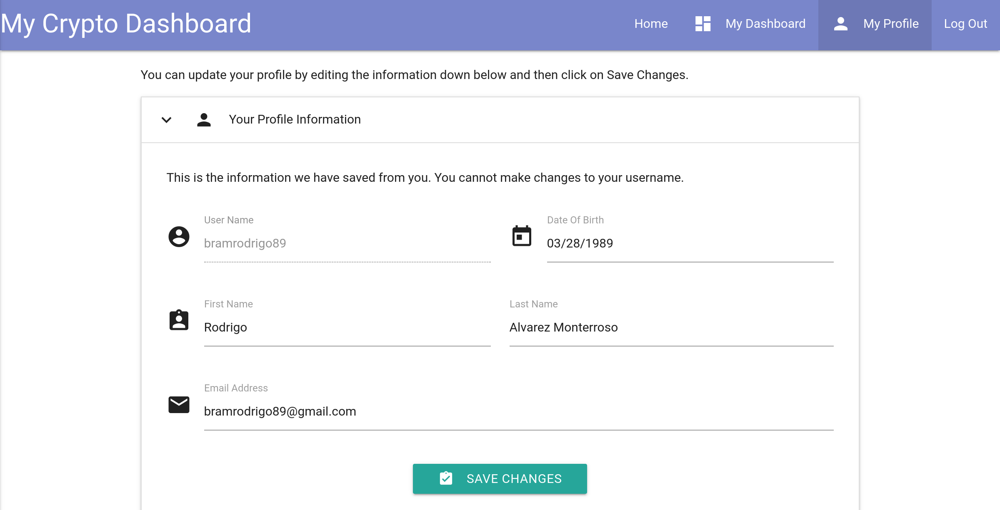
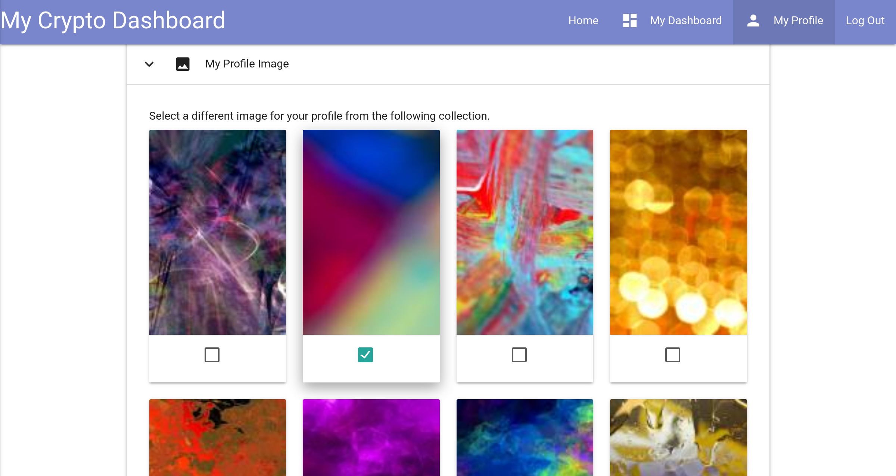
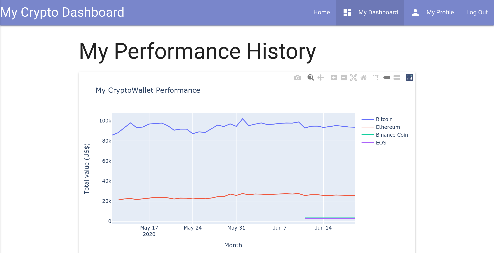
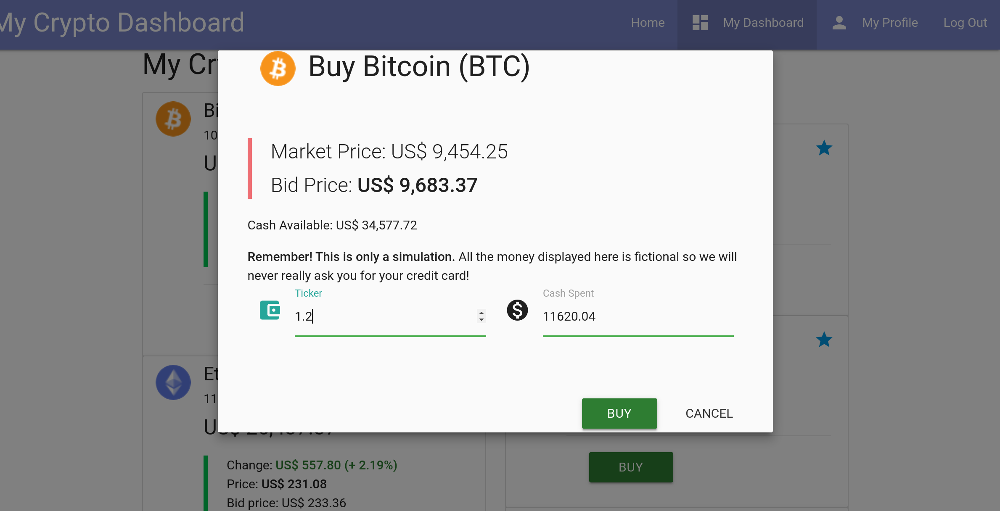
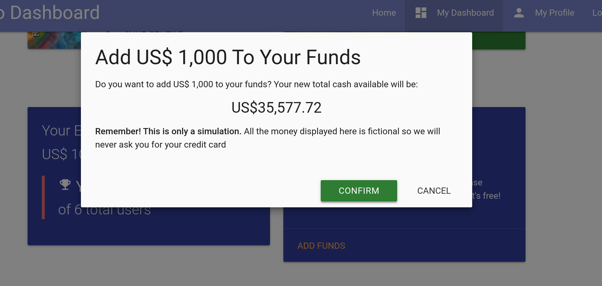

# Cryptocurrencies Dashboard

Welcome, 

The development of this web application was carried out as my Third Milestone Project for the Full-Stack Web Development Diploma from the Code Institute.  

This appliction's code was written on my own using Python, the Flask Framework, HTML5, CSS3 and JavaScript to demonstrate my personal skills and acquired knowledge from this online program. Some other libraries which are listed later on were used as well to simplify functions and styling. 

The application is deployed and available in Heroku and can be accessed here:

[My Cryptocoin Dashboard Link](https://cryptocoin-dashboard.herokuapp.com/)

Feel free to use it and reach out for any comments or suggestions that you may have. 

## UX

The main objective was to create a simulation application that allow users to learn and practice trading and monitoring cryptocurrency assets. The application was conceived as a pure simulation and thus does not handle any real currencies. All the data displayed concerning traditional or digital currencies are solely for learning purposes and do not posses any real value.
 
This importance for this web application was identified through some User Stories like the following:
 
- "I always wondered how it is to trade and hold Cryptocurrencies. I have read in the news that they are mostly earning value but I do not understand the concept of how to buy them. It would be good to find an application which allows me first to do some practice before I can go into the real thing."
- "I have heared of Bitcoin, but I do not know really if there are other Cryptocurrencies out there. It would be interesting to know which are the most popular ones and monitor if their prices are incresing."
- "Some Cryptocurrencies are very expensive. I could not afford to buy a single one. Though I would be interested to know if I can buy only part of one cryptocoin and start small and do only trading until I can earn some cash to buy more coins. But without real money I do not find an application that lets me do any trading."
- "I like trading applications that are easy to use and very visual. Specially I like being able to check my performance over time with charts and plots."

The user experience design of this application was first conceived using wireframes on miro.com. The file is available for visualization under this link: 
[Miro Wireframe - Cryptocoin Dashboard Wireframe](https://miro.com/app/board/o9J_ksDZXO4=/)
As observed on the wireframe, the "dashboard" page was designed as the main page of this application and its responsiveness for different screen sizes was considered. 

All sections of the "dashboard" page from the wireframes were developed with some minor changes:
 - The performance history line chart was moved to a separate html page to reduce API calls because they are limited by my personal account on the Alpha Vantage API service.
 - Transaction lists occupies whole width of screen now because they contain more information than other cards from dashboard. 

## Features

This application was developed using the Flask framework and most of its features revolve around the user's Dashboard where most of the information is processed and presented in an easy-to-understand way to the user.  

These are the following features already developed and implemented on this application:

### Existing Features
- User Authentication: New users are able to join and register for a new account where only a few data fields are required. New users can register on to the Sign Up page and enter the required fields of username, password, first and last name and date of birth. Username and password checks are implemented as well, so that usernames are not repeated in the database and the retyped passwords need to match from the first one typed in by the user. 

- Log In: Login function to user's account by entering username and password information. When login is successful user is notified with a dismissible toast on the page. 

- Log Out function on the respective button on the navbar, which clears the user's session information on the browser. Thus the user needs log back in if he or she wants to return to the dashboard. The user's credentials are saved however in the browser session, so if the tab is closed and opened up again, the application recognizes the logged in user and takes him or her to his or her profile again. Only when the user clicks on Log Out the browser session will be erased. 

- Edit Profile Information: Users are able to change every piece of information from their profile, except for username and passwords. User needs to confirm changes with a click on the Save Changes button, which will update the information on the database in MongoDB.

- Change Profile Image: Users are also able to personalize their profile page a little bit by chosing a different image for their profile. User can select from a collection of 10 images that are abstract and colorful. Source of these images is lorempixel.com.

- Delete Profile: In case the user decides to delete their account, they can do so by using the last option in the profile page 'Delete Profile'. This will delete all profile and transactions information from the user from the database and it is permanent. User is asked again to confirm this action. 

- Dashboard: This is the main feature of the application. Here is a visual summary of all the user's information on his or her crypto wallet. A total balance card is displayed on top with a calculation of the complete value of all assets including cash and held coins. A calculation of the total growth (or depreciation) is displayed as well with a visual color indication on the card (green or red respectively). Just below that, the available cash is displayed on a separate card to indicate how much can be invested in new coins. Moreover, the user's earned cash is displayed on a separate card as an indicator of his or her performance. The user is able to increase the earned cash value by selling coins which have gained value over the time after they were purchased. Finally, as an interesting fact to monitor, the user's rank compared to all other users is displayed here as well. 

- Assets Distribution: This is a visual representation using a pie chart of how the total balance is distributed among the different assets. This is shown as part of the dashboard.

- Performance History: This is a visual representation of the user's wallet value over time using a line chart. This chart can be found on the link HISTORY on the total balance card. The historical data serving to construct this chart comes from Alpha Vantage API Service, so in order to reduce the calls per minute, this chart is placed on a separate page - and not on the dashboard as originally planned -. The prices coming from the API refreshes every 24 hours, so after doing some purchases, it might take up to one day to be reflected on this chart. 

- Buy Cryptocoins: When the user wants to buy more coins, the available coins are displayed either on the favorites list or down below in the Other Cryptocurrencies list. This application offers data on the 18 most popular cryptocoins on the market today valued on United States dollars (US$). So the prices displayed, coming from the IEX Cloud Server, reflect their current value in US$ equivalence. The user can buy new coins on the button BUY displayed on every coin. A new modal appears automatically showing only the respective data for that coin. The user needs now to select the amount (ticker) of that coin that should be purchased. On the right, the equivalent amount in US$ is displayed automatically. Reversivly, the user can enter the amount in US$ as well to be translated into that coin's ticker entry. The application rules out invalid entries such as not numbers or negative values. In case the user wants to buy more coins for which he or she has not enough funds yet, the BUY buttom becomes disabled automatically.

- Succesful Transactions: In case a coin purchase or a coin sale was successful, the user is also reassured with a toast message. The transaction info appears now in the latest transactions section just down below. 

- Add More Funds: This is a function that can be used but in case the user wants to buy more coins but his or her funds are not enough. Since this is a simulation and it does not manage real value money, funds can be added limitleslly, but it is not encouraged to use this function as it is expected that the user builds up earned cash by trading coins preferably. But why not adding a few kilo dollars to buy that desired cryptocoin when the time is right? So that is what this function is for!

In addition, these are the plans for additional features to be implemented in the future:

### Features Left to Implement
- Feature 2

## Technologies Used

Languages, frameworks, libraries used to construct this project:

- Python
- HTML5
- CSS3
- JavaScript
- [IEX Cloud Financial Data API](https://iexcloud.io/)
    - Real-Time & historical financial data for this web application. The IEX Cloud sandbox was mostly used to test out and integrate the API into the application. 
- [MongoDB](https://www.mongodb.com/cloud/atlas)
    - Data storage and database management
- [jQuery](https://jquery.com/)
    - jQuery code was used to simplify HTML DOM tree traversal and manipulation, as well as event handling, CSS animation, and Ajax.
- [Materialize CSS](https://materializecss.com/)
    - The project uses **Materialize** to simplify giving styles and adding JavaScripts to different elements. Also it is found in the navbar construct, its grid-layout system was used, as well as other elements like modals, tables, badges, etc to complement the application. 
- [Plotly Graphic Libraries](https://plotly.com/graphing-libraries/)
    - Plotly Open Source Graphing Libraries: interactive charts and maps for Python and JavaScript.
- [GitPod](https://www.gitpod.io/)
    - Online IDE for GitHub to develop code of this project. 
- [Font Awesome Icon Library](https://fontawesome.com/icons?d=gallery)
    - Icons were imported to provide some visual iconography, e.g. star icon for buttons to save stocks in Watch List.
- [Google Font Library](https://fonts.google.com/)
    - Imported two different fonts, Abril Fatface and Questrial for texts. 
- [Am I Responsive](http://ami.responsivedesign.is)
    - Testing responsiveness of the applicaton in different devices, like the example below:
- [Cryptocurrency Icons](https://github.com/spothq/cryptocurrency-icons)
    - Creating cryptocurrency icons for coins used in this project. Library includes SVG files for around 400 crypto currencies to create 32x32 PNG files respectively. 
- [Unsplash Images](https://unsplash.com/)
    - The internet’s source of freely-usable images.

## Testing

### Problem Solving

During the development phase I encountered some bugs which had to be solved

1. **Problem** 
    - **Solution** 

Bugs that remain unsolved:

1. **Problem** 

### Performance 

### Front End 

### Back End

Entity Relationship Diagram (ERD) of Database for this application

## Deployment

The code was developed solely on GitPod and then it was pushed to an external repository on [GitHub](https://github.com/bramrodrigo89).

To deploy the project from its repository to Heroku, the following should be taken:

1. Log in to GitHub.com
2. From the repository screen, select this project "/second-milestone-project"
3. On top of the page, click on the last right icon "Settings".
4. Scroll down until you reach the GitHub Pages section.
5. Change the source to the "Master Branch" using the drop down menu, labelled by default first as "none".
6. The application is now deployed on GitHub pages!
7. Copy the provided link from this section and share with others.

## Credits

### Content

### Media

### Acknowledgements

- I received inspiration for this project from my family. 
- Special thanks to my mentor from Code Institute for the direction I needed:
- And last but not least, many thanks to the Tutor Team from Code Institute 
